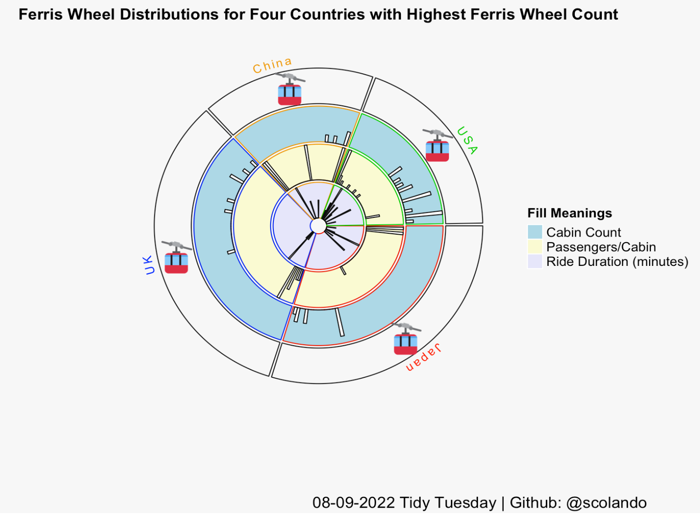

## The Data 

This week's Tidy Tuesday data comes from Emil Hvitfeldt's Ferris Wheel package. Very fun package and theme!

```{r setup, include=FALSE}
knitr::opts_chunk$set(echo = TRUE)
library(tidyverse)
library(countrycode)
library(circlize)
library(png)
suppressPackageStartupMessages(library(ComplexHeatmap))
```

```{r message=FALSE, warning=FALSE}
wheels <- readr::read_csv('https://raw.githubusercontent.com/rfordatascience/tidytuesday/master/data/2022/2022-08-09/wheels.csv')
```
```{r}
wheels %>%
  glimpse()
```

## Data Wrangling

```{r warning=FALSE}
# goal: extract continent variable via countrycode package
ferris_wheels <- wheels %>%
  mutate(continent = countrycode(country,
                                 origin = "country.name",
                                 destination = "continent")) %>%
  mutate(continent = case_when(
    country == "Dubai" ~ "Asia",
    country == "Phillippines" ~ "Asia",
    country == "Tailand" ~ "Asia",
    TRUE ~ continent))
```

```{r}
# filtering the countries with the highest ferris wheels

countries_multiple_ferris <- ferris_wheels %>%
  group_by(country) %>%
  count() %>%
  arrange(desc(n)) %>%
  filter(n > 3)
```

```{r}
#getting rid of na to make circle package 
df <- ferris_wheels %>%
  select(name, country, continent, height, number_of_cabins, passengers_per_cabin, ride_duration_minutes) %>%
  filter(country %in% countries_multiple_ferris$country) %>%
  drop_na()
```


```{r}
df_pivot <- pivot_longer(df, cols = height:ride_duration_minutes, names_to = "variable_type", values_to = "value") %>%
  arrange(variable_type)
```


```{r}
# picking variables with roughly same distribution/value magnitude
skim <- df_pivot %>%
  group_by(variable_type) %>%
  select_if(is.numeric) %>%
  skimr::skim() 

skim %>%
  select(skim_variable,variable_type, numeric.mean, numeric.hist)
```

## The Plot

```{r}
# creating manual legend
lgd_fill = Legend(at = c("Cabin Count", "Passengers/Cabin", "Ride Duration (minutes)"), type = "grid", 
    legend_gp = gpar(fill = c("lightblue", "lightgoldenrodyellow", "lavender")), title_position = "topleft", 
    title = "Fill Meanings")
```

```{r eval = FALSE}
# the wheely cool plot
par(bg = "gray97")

circos.initialize(df_pivot$country[38:148], x = df_pivot$value[38:148])

circos.track(ylim = c(0, 1), bg.col = "gray97", bg.border = "gray97", track.height = 0.1)

circos.text(x = -15, y = .5, labels = "China", facing = "bending.inside", col = "orange2", cex = .75)

circos.text(x = 27.5, y = .5, labels = "USA", facing = "bending.inside", col = "green3", cex = .75)

circos.text(x = 75, y = .5, labels = "Japan", facing = "bending.inside", col = "red", cex = .75)

circos.text(x = 140, y = .5, labels = "UK", facing = "bending.inside", col = "blue", cex = .75)

circos.track(ylim = c(0, 1), panel.fun = function(x, y) {
    pos = circlize:::polar2Cartesian(circlize(CELL_META$xcenter, CELL_META$ycenter))
    image = png::readPNG("cabin.png")
    rasterImage(image, 
        xleft = pos[1, 1] - 0.1, ybottom = pos[1.5, 2] - 0.1,
        xright = pos[1, 1] + 0.1, ytop = pos[1.5, 2]+ 0.1)
}, bg.col = "gray97", bg.border = "grey10", track.height = 0.2)

circos.trackHist(df_pivot$country[38:74], x = df_pivot$value[38:74], col = "white", 
    border = "grey5", bin.size = 1, bg.col = "lightblue", bg.border = c("red2", "blue2","orange2", "green3"))

circos.trackHist(df_pivot$country[75:111], x = df_pivot$value[75:111], force.ylim = FALSE, col = "white", 
    border = "grey5", bin.size = 1, bg.col = "lightgoldenrodyellow", bg.border = c("red2", "blue2","orange2", "green3"))
circos.trackHist(df_pivot$country[111:148], x = df_pivot$value[111:148], force.ylim = FALSE, col = "white", 
    border = "grey5", bin.size = 1, bg.col = "lavender", bg.border = c("red2", "blue2","orange2", "green3"))

draw(lgd_fill, x = unit(.85, "npc") + unit(1, "mm"), y = unit(75, "mm"), 
    just = c("right"))

title("Ferris Wheel Distributions for Four Countries with Highest Ferris Wheel Count", cex.main = 1)

title(sub = "08-09-2022 Tidy Tuesday | Github: @scolando", cex.main = .75, adj = 0.75)
```

```{r fig.width= 10, fig.height=10, fig.align='center', out.width= '75%'}
# because i do not like the way of saving base graphs (the dpi was awful)

```

```{r}
praise::praise()
```

