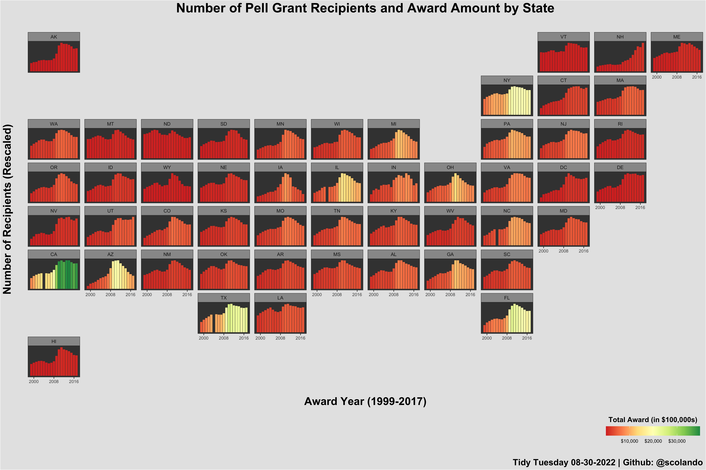

```{r setup, include=FALSE}
knitr::opts_chunk$set(echo = TRUE)
library(tidyverse)
library(geofacet)
library(scales)
```

```{r warning=FALSE, message=FALSE}
pell <- readr::read_csv('https://raw.githubusercontent.com/rfordatascience/tidytuesday/master/data/2022/2022-08-30/pell.csv')
```

```{r warning=FALSE, message=FALSE}
df <- pell %>%
  group_by(STATE, YEAR) %>%
  summarise(total_award = sum(AWARD), total_recipient = sum(RECIPIENT)) %>%
  mutate(award_hundred_thousand = total_award/100000)
  
plot <- df %>% 
ggplot(aes(x = YEAR, y = total_recipient, fill = award_hundred_thousand))+
  geom_bar(stat = "identity")+
  facet_geo(~ STATE, scales = "free_y", grid = "us_state_grid2")+
  theme_bw()+
  scale_x_continuous(breaks = c(2000,2008, 2016))+
  theme(axis.text.y = element_blank(), axis.text.x = element_text(size = 8), axis.ticks.y = element_blank(), title = element_text(face = "bold", size = 20), legend.position = "bottom", legend.justification = "right", plot.title = element_text(hjust = 0.5), panel.grid.major = element_blank(), panel.grid.minor = element_blank(),
        panel.background = element_rect(fill = "grey25"), plot.background = element_rect(fill = "grey90"), strip.background = element_rect(fill = "grey60"), legend.background = element_rect(fill = "grey90"), legend.title = element_text(size = 13))+
  xlab("\nAward Year (1999-2017)")+
  ylab("Number of Recipients (Rescaled)\n")+
  ggtitle("Number of Pell Grant Recipients and Award Amount by State\n")+
  guides(fill = guide_colorbar(title.position = "top", title = "Total Award (in $100,000s)", title.hjust = .5, barwidth = 12))+
  scale_fill_distiller(palette = "RdYlGn", direction = 1, na.value = NA, labels = dollar)+
  labs(caption = "\nTidy Tuesday 08-30-2022 | Github: @scolando")

ggsave("pell_grants.jpg", plot = plot, width = 18, height = 12, units = "in")
```

```{r warning=FALSE}
plot_alt <- df %>% 
ggplot(aes(x = YEAR, y = total_recipient, fill = award_hundred_thousand))+
  geom_bar(stat = "identity")+
  facet_geo(~ STATE, grid = "us_state_grid2")+
  theme_bw()+
  scale_x_continuous(breaks = c(2000,2008, 2016))+
  theme(axis.text.y = element_blank(), axis.text.x = element_text(size = 8), axis.ticks.y = element_blank(), title = element_text(face = "bold", size = 20), legend.position = "bottom", legend.justification = "right", plot.title = element_text(hjust = 0.5), panel.grid.major = element_blank(), panel.grid.minor = element_blank(),
        panel.background = element_rect(fill = "grey25"), plot.background = element_rect(fill = "grey90"), strip.background = element_rect(fill = "grey60"), legend.background = element_rect(fill = "grey90"), legend.title = element_text(size = 13))+
  xlab("\nAward Year (1999-2017)")+
  ylab("Number of Recipients \n")+
  ggtitle("Number of Pell Grant Recipients and Award Amount by State\n")+
  guides(fill = guide_colorbar(title.position = "top", title = "Total Award (in $100,000s)", title.hjust = .5, barwidth = 12))+
  scale_fill_distiller(palette = "RdYlGn", direction = 1, na.value = NA, labels = dollar)+
  labs(caption = "\nTidy Tuesday 08-30-2022 | Github: @scolando")

ggsave("pell_grants_alt.jpg", plot = plot_alt, width = 18, height = 12, units = "in")
```

```{r echo = FALSE}


```

```{r}
praise::praise()
```

