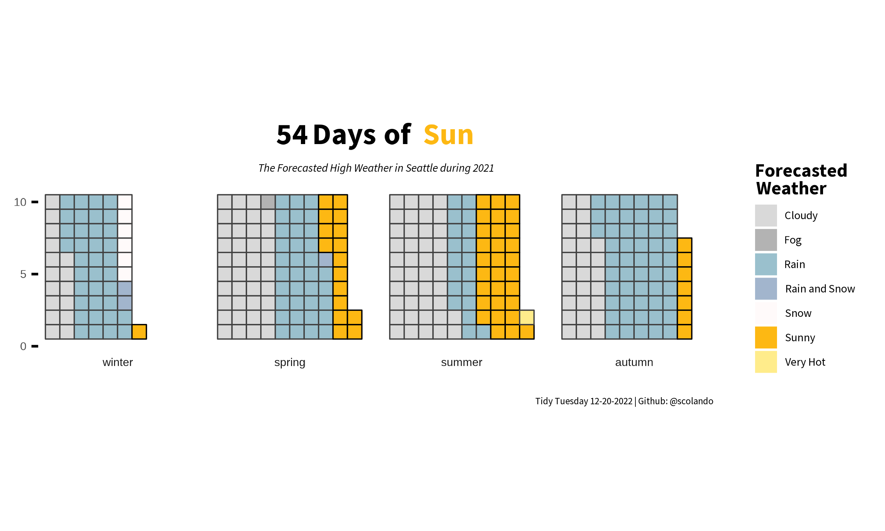
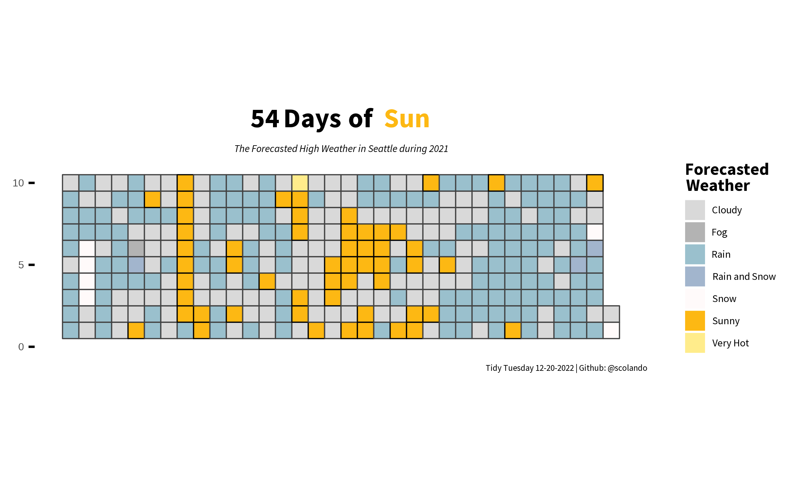

```{r setup, include=FALSE, message=FALSE, warning=FALSE}
knitr::opts_chunk$set(echo = TRUE)
library(tidyverse)
library(waffle)
library(hydroTSM)
library(lubridate)
library(showtext)
library(ggtext) 
```

```{r message=FALSE, warning=FALSE}
font_add_google("Source Sans Pro")
showtext_auto()
```


```{r message=FALSE, warning=FALSE}
weather_forecasts <- readr::read_csv('https://raw.githubusercontent.com/rfordatascience/tidytuesday/master/data/2022/2022-12-20/weather_forecasts.csv')
cities <- readr::read_csv('https://raw.githubusercontent.com/rfordatascience/tidytuesday/master/data/2022/2022-12-20/cities.csv')
outlook_meanings <- readr::read_csv('https://raw.githubusercontent.com/rfordatascience/tidytuesday/master/data/2022/2022-12-20/outlook_meanings.csv')
```

```{r message=FALSE, warning=FALSE}
seattle_df <- weather_forecasts %>% left_join(cities, by = c("city","state")) %>%
  filter(city == "SEATTLE") %>%
  mutate(season = time2season(date, out.fmt = "seasons")) %>%
  mutate(year = year(date)) %>%
  filter(year == 2021) %>%
  filter(forecast_hours_before == 12) %>%
  drop_na(forecast_outlook) %>%
  mutate(forecast_outlook = if_else(forecast_outlook == "SHWRS", "RAIN",forecast_outlook)) %>%
   mutate(forecast_outlook = if_else(forecast_outlook == "PTCLDY", "CLOUDY",forecast_outlook)) %>%
  mutate(forecast_outlook = if_else(forecast_outlook == "MOCLDY", "CLOUDY",forecast_outlook)) %>%
    mutate(forecast_outlook = if_else(forecast_outlook == "SNOSHW", "SNOW",forecast_outlook)) %>%
  mutate(season = if_else(season == "autumm","autumn",season)) %>%
  filter(high_or_low == "high") %>%
  left_join(outlook_meanings, by = "forecast_outlook") 
```

```{r message=FALSE, warning=FALSE}
seattle_grouped <- seattle_df %>%
  group_by(meaning, season) %>%
  summarize(n = n())

seattle_grouped$season <- factor(seattle_grouped$season, levels=c('winter', 'spring', 'summer', 'autumn'))

seattle_grouped <- seattle_grouped %>%
  mutate(outline = if_else(meaning == "Sunny","black","grey25"))
```


```{r eval = FALSE}
cols <- c("Rain" = "lightblue3", "Cloudy" = "gray85", "Snow" = "snow1", "Sunny" = "#FDB813", "Rain and Snow" = "lightsteelblue3", "Fog" = "grey70", "Very Hot" = "lightgoldenrod1")

seattle_grouped %>%
  ggplot()+
  geom_waffle(aes(fill = meaning, values = n, colour = outline), size = .25)+
  facet_wrap(~season, strip.position = "bottom", nrow = 1)+
  scale_y_continuous(breaks = c(0,5,10))+
  coord_equal()+
  labs(title = "<span style='font-size:64pt'>54  Days   of 
       <span style='color:#FDB813;'> Sun</span></span>",
       subtitle = "The Forecasted High Weather in Seattle during 2021", caption = "Tidy Tuesday 12-20-2022 | Github: @scolando")+
    guides(fill = guide_legend(title = "Forecasted\nWeather"), color = "none")+
  theme_minimal()+
  theme(panel.grid = element_blank(), axis.ticks.y = element_line(),
        strip.text = element_text(size = 24),
        axis.text.x = element_blank(),
        legend.title = element_text(size = 40, face = "bold", family = "Source Sans Pro", margin = margin(b = 0.01,1,1,1,"pt"), lineheight = 0.15),
        legend.key.size = unit(.35, 'cm'),
        legend.key.height = unit(.35, 'cm'),
        legend.key.width = unit(.35, 'cm'),
        axis.text.y = element_text(size = 24),
        plot.title = element_markdown(lineheight = 100, family = "Source Sans Pro", face = "bold", hjust = 0.5, box.color = "black"),
        legend.text = element_text(family = "Source Sans Pro", size = 24, margin = margin(l = .01,1,1,1,"pt")),
        plot.subtitle = element_text(hjust = 0.5, face = "italic", family = "Source Sans Pro", size = 24),
        plot.caption = element_text(family = "Source Sans Pro", size = 20),
        legend.spacing.x = unit(1.0, 'mm'),
        legend.spacing.y = unit(1.0, 'mm'))+
  scale_fill_manual(values= cols)+
  scale_color_manual(values = c("black","grey25"))
```

```{r echo = FALSE, eval=FALSE}
ggsave("seattle_sun.png", height = 3, width = 5, dpi = 500, bg = "white")
```

```{r echo=FALSE, out.width = '100%'}

```

```{r message=FALSE, warning=FALSE}
df_check <- seattle_df %>%
  group_by(date,meaning) %>%
  summarize(n = n()) %>%
  mutate(outline = if_else(meaning == "Sunny","black","grey25"))
```

```{r eval = FALSE}
seattle_df %>%
  group_by(date,meaning) %>%
  summarize(n = n()) %>%
  mutate(outline = if_else(meaning == "Sunny","black","grey25")) %>%
  ggplot()+
  geom_waffle(aes(fill = meaning, values = n, colour = outline), size = .25)+
  scale_y_continuous(breaks = c(0,5,10))+
  coord_equal()+
  labs(title = "<span style='font-size:64pt'>54  Days   of 
       <span style='color:#FDB813;'> Sun</span></span>",
       subtitle = "The Forecasted High Weather in Seattle during 2021", caption = "Tidy Tuesday 12-20-2022 | Github: @scolando")+
    guides(fill = guide_legend(title = "Forecasted\nWeather"), color = "none")+
  theme_minimal()+
  theme(panel.grid = element_blank(), axis.ticks.y = element_line(),
        axis.text.x = element_blank(),
        legend.title = element_text(size = 40, face = "bold", family = "Source Sans Pro", margin = margin(b = 0.01,1,1,1,"pt"), lineheight = 0.15),
        legend.key.size = unit(.35, 'cm'),
        legend.key.height = unit(.35, 'cm'),
        legend.key.width = unit(.35, 'cm'),
        axis.text.y = element_text(size = 24),
        plot.title = element_markdown(lineheight = 100, family = "Source Sans Pro", face = "bold", hjust = 0.5, box.color = "black"),
        legend.text = element_text(family = "Source Sans Pro", size = 24, margin = margin(l = .01,1,1,1,"pt")),
        plot.subtitle = element_text(hjust = 0.5, face = "italic", family = "Source Sans Pro", size = 24),
        plot.caption = element_text(family = "Source Sans Pro", size = 20),
        legend.spacing.x = unit(1.0, 'mm'),
        legend.spacing.y = unit(1.0, 'mm'))+
  scale_fill_manual(values= cols)+
  scale_color_manual(values = c("black","grey25"))
```

```{r echo = FALSE, eval=FALSE}
ggsave("seattle_sun_no_facet.png", height = 3, width = 5, dpi = 500, bg = "white")
```

```{r echo=FALSE, out.width = '100%'}

```
